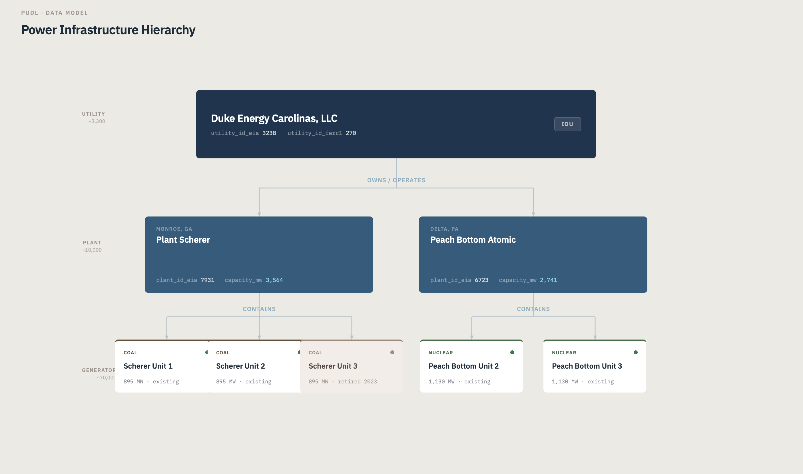
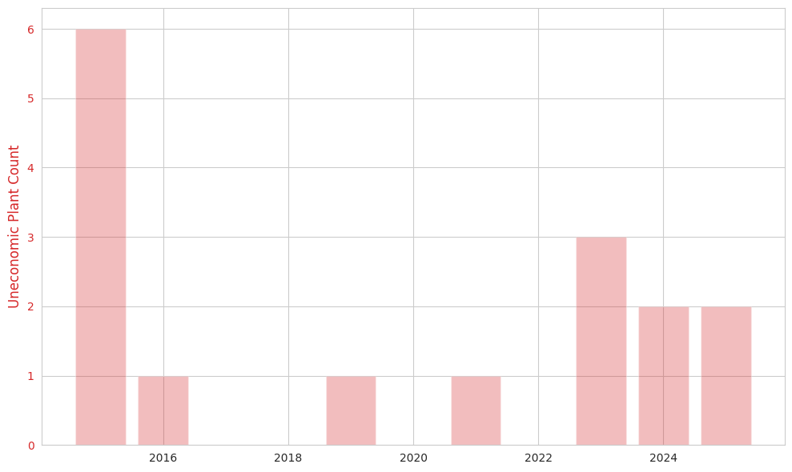
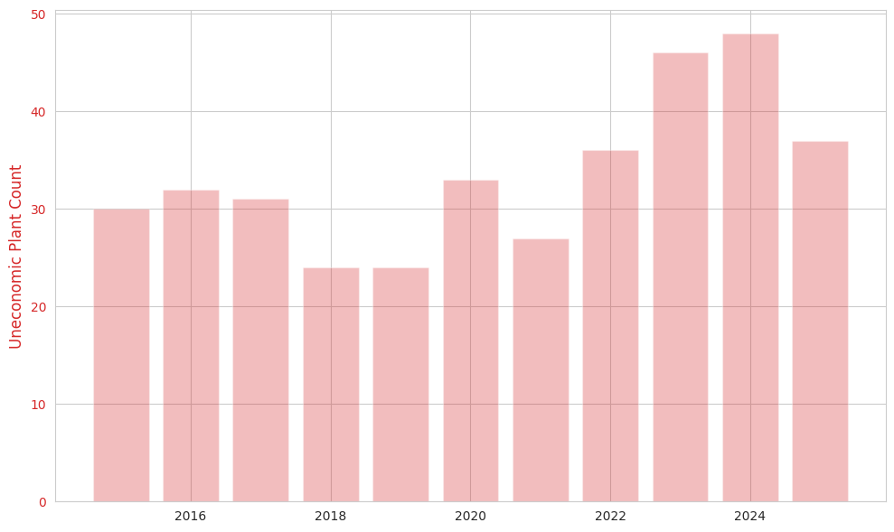
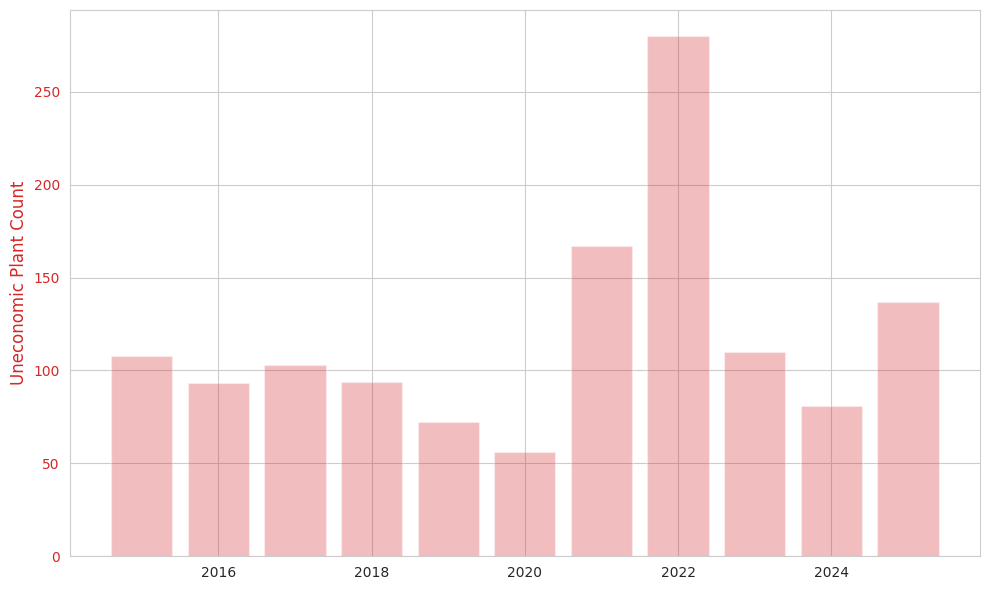

# PUDL Data Integration — Uneconomic Fossil Fuel Plants in the US

A Databricks-based data integration project that joins **FERC Form 1** financial filings with **EIA-860/923** generator data to identify which older fossil-fuel power plants are uneconomic to operate, and traces where the ratepayer money flows.

> Source data: [PUDL](https://catalystcoop-pudl.readthedocs.io/) (Public Utility Data Liberation) by Catalyst Cooperative.

---

## Research Questions

1. **Q1**: Which  fossil-fuel plants are uneconomic, i.e. their operating cost per MWh is so high that they would not survive in a competitive market?
2. **Q2**: For these uneconomic plants, where does the revenue ultimately go — regulated utilities, independent power producers, or public/municipal entities?

---

## Data Source

This project uses [PUDL (Public Utility Data Liberation)](https://catalystcoop-pudl.readthedocs.io/) — the open-source curated US energy dataset maintained by [Catalyst Cooperative](https://catalyst.coop/).

- **Release**: `2026.6.1` (stable)
- **AWS Open Data path**: `s3a://pudl.catalyst.coop/2026.6.1/`



 Input tables loaded by Notebook 1:

| Table | Purpose |
|---|---|
| `core_ferc1__yearly_steam_plants_sched402` | FERC Form 1 O&M costs (plant-year grain) |
| `core_ferc1__yearly_steam_plants_fuel_sched402` | FERC fuel data (fuel × plant-year grain) |
| `out_eia__yearly_generators` | EIA-860 + EIA-923 generator-level data, pre-joined |
| `core_eia860__scd_plants` | EIA plant entity / sector classification |
| `core_pudl__assn_ferc1_pudl_utilities` | FERC → PUDL utility crosswalk |
| `core_pudl__assn_eia_pudl_utilities` | EIA → PUDL utility crosswalk |
| `core_pudl__assn_ferc1_pudl_plants` | FERC → PUDL plant crosswalk (the key bridge for FERC ↔ EIA at plant level) |

---

## Architecture

Three Databricks notebooks chained via `%run`, are loaded only in memory and are not saved for the purpose of this project, Ideally some of the tables should be stored as Delta tables for Later Use.

| Notebook | Role | Output |
|---|---|---|
| `1.Exploration` |  load PUDL tables, profile, surface data quality issues | (`*_first`) |
| `2.Transformation` | clean, integrate, build analytical tables | (`*_final`) |
| `3.Results` |  tables answering Q1 and Q2 | display tables |

---

## How to Run


```bash
git clone https://github.com/krakenkhan/pudl_data_integration.git
```
OR

1. Import pudl_data_integration.dbc into your Databricks workspace (**Workspace → Import → From file**)
2. Open `3.Results`
3. Click **Run all**

`3.Results` calls `%run "./2.Transformation"`, which calls `%run "./1.Exploration"`. The entire pipeline runs end to end in a single Spark session.


---

## Pipeline Flow

### 1. Exploration

Loads seven PUDL parquet tables from S3 and profiles each one:

- Row counts and column schemas
- Year coverage per table
- Null analysis on critical columns
- Plant name variation within FERC
- Crosswalk coverage (FERC ↔ PUDL ↔ EIA)
- End-to-end bridge test confirming the join works

Each table is registered as a temp view with the `*_first` suffix for the downstream notebooks.

### 2. Transformation 

The central join uses **`plant_id_pudl`** as the bridge between FERC and EIA. PUDL maintains a stable internal ID for each physical plant. FERC O&M gets it via `core_pudl__assn_ferc1_pudl_plants`; EIA generators carry it natively in `out_eia__yearly_generators`.

Outputs:

| Table | Grain | Approximate rows |
|---|---|---|
| `plant_economics_final` | (utility, plant, year) | 3,000–15,000 |
| `utility_summary_final` | (utility, year) | a few hundred |

### 3. Results (Analysis)

- **Verdict columns** (e.g. `why_uneconomic` with text labels like `Zombie — paying with no output`, `Extreme cost — over $100/MWh`)

Uneconomic plant counts per year (operating cost > $50/MWh), broken down by fuel type:

#### Oil plants


A small category — most years have one or two uneconomic oil plants, with an outlier spike of six in 2015.

#### Gas plants


Steady at 24–32 plants in the late 2010s, climbing to a peak of 48 in 2024 before easing back in 2025.

#### Coal plants


The largest category, with a clear 2022 surge to 280 uneconomic plant-years — likely driven by the spike in coal fuel prices that year. Coal returns to a higher baseline than pre-2020.
---


## Caveats and Limitations

- `utility_class` is a coarse classification (regulated / IPP / self-generation / other). Separating IOU from municipal would require additionally joining `core_eia860__scd_utilities` for the utility `entity_type`.
- The `$50/MWh` threshold for "uneconomic" is editorial and requires further research for an accurate Industry Medium.
- Some plants have null `plant_heat_rate` or `plant_capacity_factor` due to EIA reporting gaps; these are filtered explicitly where it matters.

---

## Project Structure

```
.
├── README.md            
├── 1.Exploration        
├── 2.Transformation     
└── 3.Results            
```

---

## Acknowledgments

- **[PUDL](https://catalystcoop-pudl.readthedocs.io/)** by [Catalyst Cooperative](https://catalyst.coop/) — the curated dataset that made this project possible
- **FERC Form 1** — source of utility financial filings
- **EIA Forms 860 and 923** — source of generator-level operating data

---

## Academic Context

This project was developed as part of the Data Integration coursework at GISMA Business School. The analysis is done in order to  identify inefficient fossil-fuel infrastructure that continues to be paid for by consumers despite producing little or no electricity.
